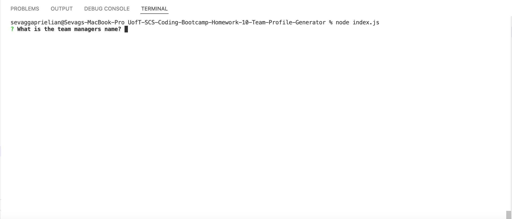
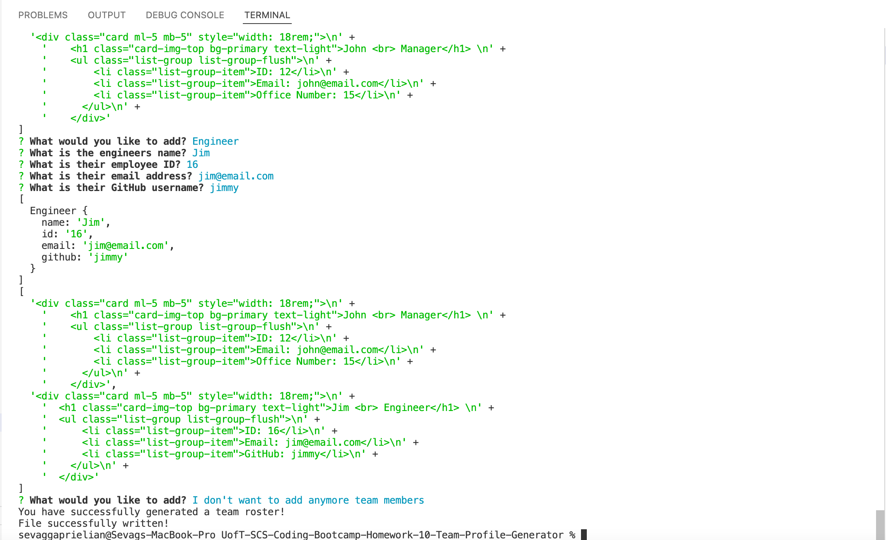
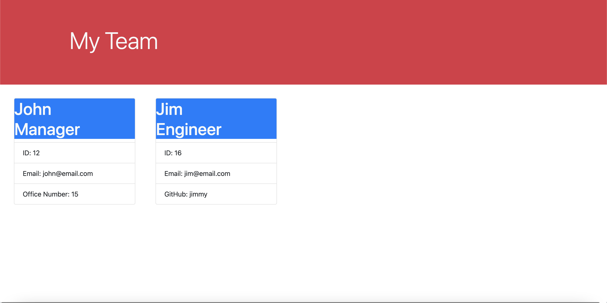

# UofT-SCS-Coding-Bootcamp-Homework-10-Team-Profile-Generator

## Table of Contents
* [Description](#desc)  
* [Installation](#install)  
* [Usage](#usage)  
* [Credits](#credits)  
* [License](#license)  
* [Github](#github)  

## Description

The purpose of this project was to create a command-line application that takes user information about employees on a software engineering team, then generates an HTML webpage that displays summaries for each person. Testing was also required for this project, as we were responsible for writing a unit test for every part of the code and ensursing it passed each test.

## Installation
 Download the repository and open it in Visual Studio Code. Enter npm install in the command line to install the inquirer package. Once the installation is complete enter the command node index.js to start the application.
 
 
## Usage
The following image shows the application's appearance and functionality.

The application should appear as follows after executing the node index.js command:

The application should appear as follows after the user has successfully inputed all the information:

The generated HTML should appear as follows:

 
## Credits
Uoft SCS Coding Bootcamp Gitlab

 
## License
Copyright [2021] [Sevag Gaprielian]

Licensed under the Apache License, Version 2.0 (the "License"); you may not use this file except in compliance with the License.
You may obtain a copy of the License at http://www.apache.org/licenses/LICENSE-2.0.

Unless required by applicable law or agreed to in writing, software
distributed under the License is distributed on an "AS IS" BASIS,
WITHOUT WARRANTIES OR CONDITIONS OF ANY KIND, either express or implied.
See the License for the specific language governing permissions and
limitations under the License.

 
## GitHub
Github: sevaggap  
Walkthrough Video: https://drive.google.com/file/d/1-lQneQn-a2uufQ9xb11qL5GqhAdvJmzG/view?usp=sharing